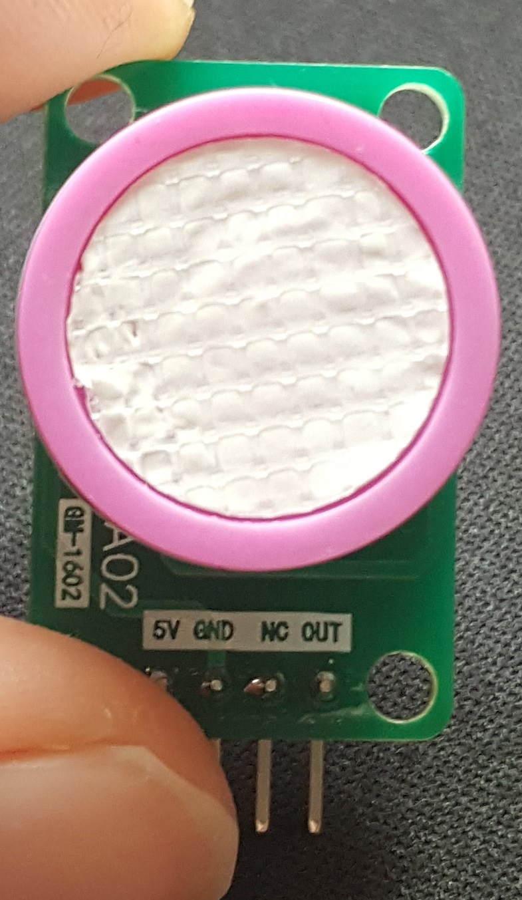

# GM1602lib
This driver is for the [GM1602-CO Sensor](GM1602-CO%20datasheet.pdf)

## Getting started

download ZIP and import by Arduino IDE

You can run example file then you will know how to use it

## GM1602
This precision sensor from Honeywell is the best sensing solution for measuring CO gas.

Detect gas : CO (0~1000ppm)

Input voltage : DC5V ± 0.2V

Input current : 5mA

AO output : 

0ppm ±10mV

1000ppm output about 1000mV

1ppm increase about 1mV

Work temperature : -20 ~ 50°C

[more detail ......](GM1602-CO%20datasheet.pdf)

## Compatibility

It must be work on all arduino board 

You need to initialize  3V or 5V what your ADC Supply voltage

## License

MIT License

Copyright (c) 2020 HuangYuTse

Permission is hereby granted, free of charge, to any person obtaining a copy
of this software and associated documentation files (the "Software"), to deal
in the Software without restriction, including without limitation the rights
to use, copy, modify, merge, publish, distribute, sublicense, and/or sell
copies of the Software, and to permit persons to whom the Software is
furnished to do so, subject to the following conditions:

The above copyright notice and this permission notice shall be included in all
copies or substantial portions of the Software.

THE SOFTWARE IS PROVIDED "AS IS", WITHOUT WARRANTY OF ANY KIND, EXPRESS OR
IMPLIED, INCLUDING BUT NOT LIMITED TO THE WARRANTIES OF MERCHANTABILITY,
FITNESS FOR A PARTICULAR PURPOSE AND NONINFRINGEMENT. IN NO EVENT SHALL THE
AUTHORS OR COPYRIGHT HOLDERS BE LIABLE FOR ANY CLAIM, DAMAGES OR OTHER
LIABILITY, WHETHER IN AN ACTION OF CONTRACT, TORT OR OTHERWISE, ARISING FROM,
OUT OF OR IN CONNECTION WITH THE SOFTWARE OR THE USE OR OTHER DEALINGS IN THE
SOFTWARE.